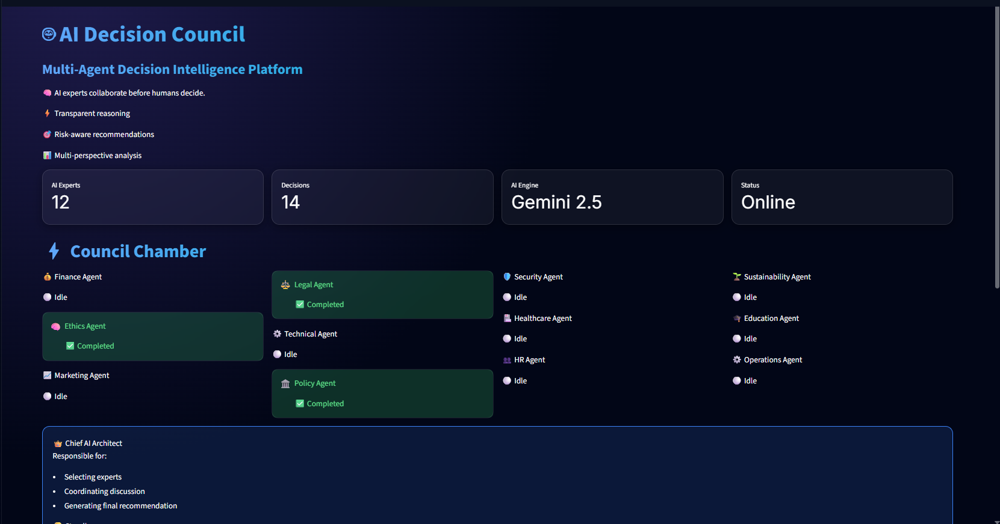
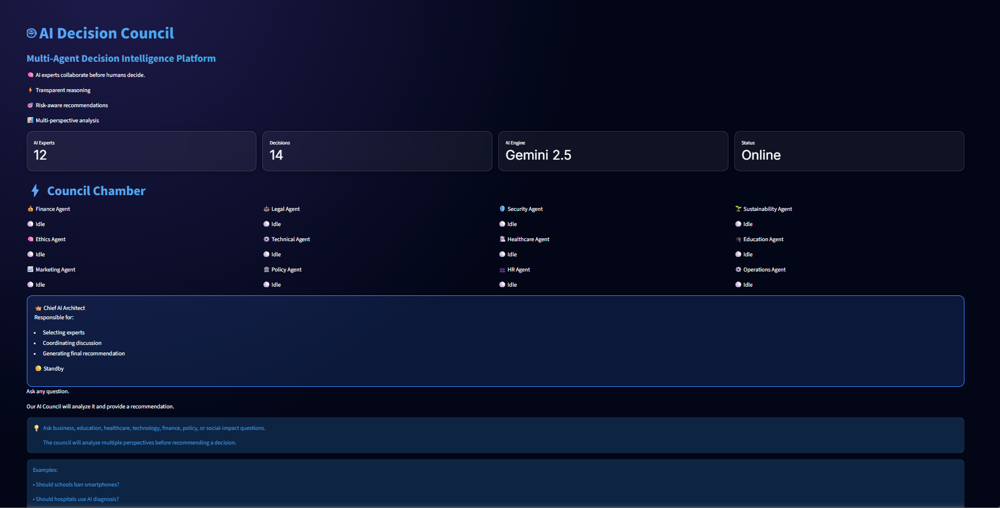

# AI Decision Council

## Setup

Before running this project, create a file:

.streamlit/secrets.toml

Add your Gemini API key:

GEMINI_API_KEY = "YOUR_GEMINI_API_KEY"

Then install the required packages:

pip install -r requirements.txt

Run:

streamlit run app.py

## 📸 Project Preview

### Home Page

### Council Discussion

### Analytics Dashboard

### Decision History

